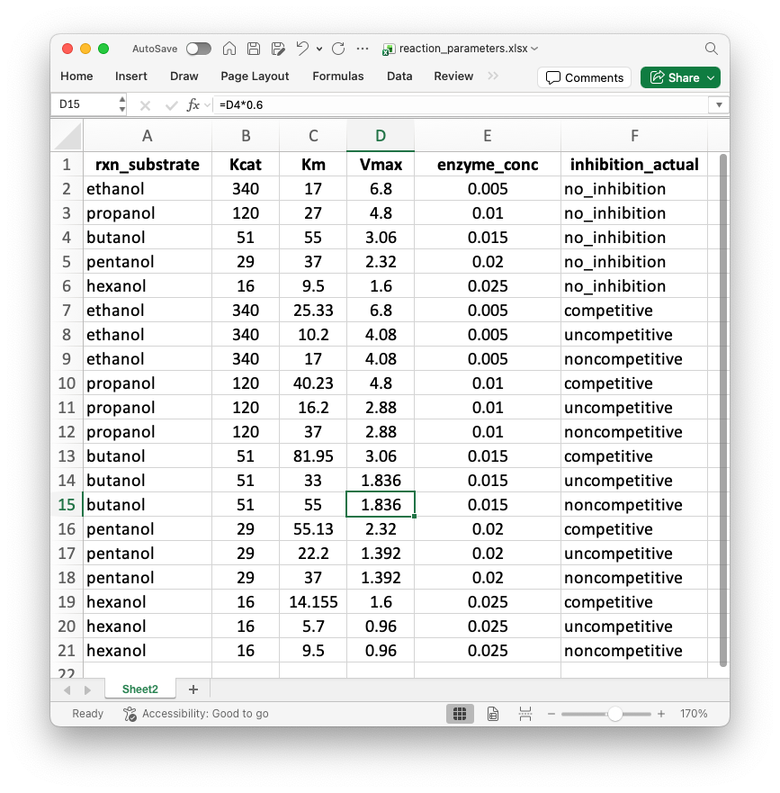
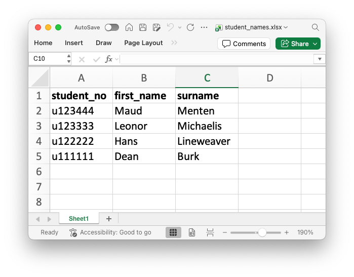
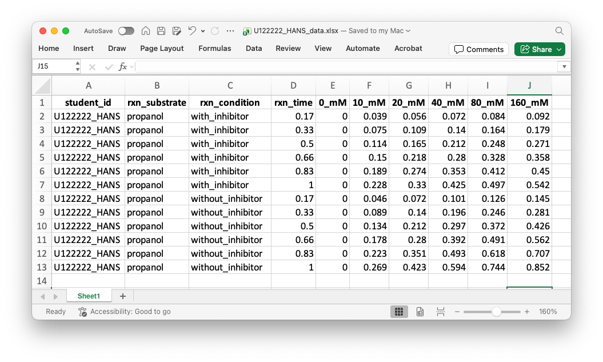
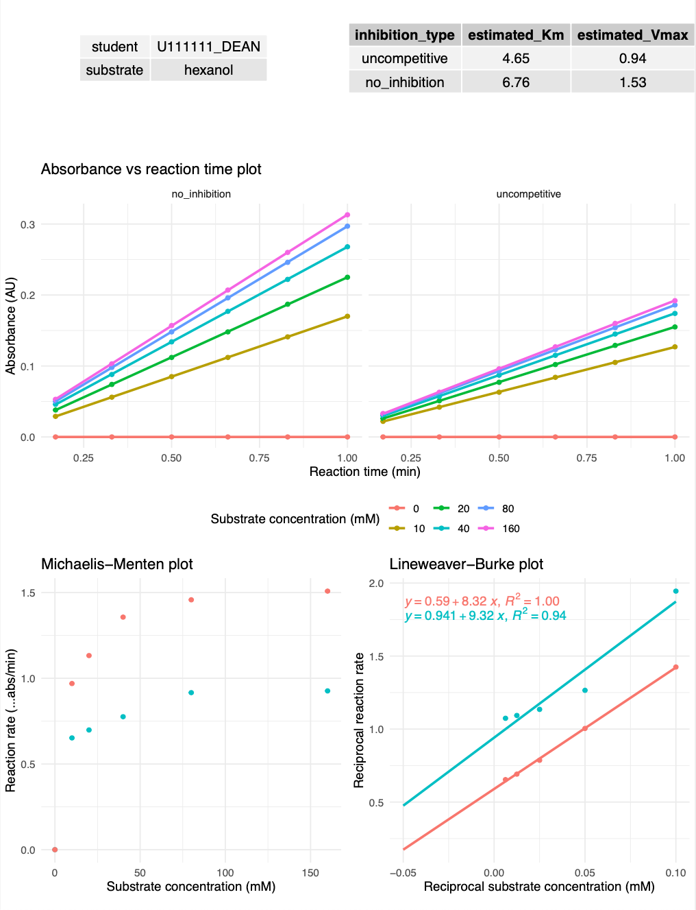

# maudr

## Introduction

**maudr** is an R package designed to generate, distribute, and evaluate enzyme kinetics data for teaching and assessment in undergraduate biochemistry laboratory courses. It allows instructors to produce individualized, experimental datasets based on real enzyme parameters, complete with enzyme inhibition conditions, and to produce corresponding answers with visual summaries. The package uses yeast alcohol dehydrogenase with five alcohol substrates as a default enzyme, but can be extended to any enzyme for which basic processing parameters are known. The name of the package is a play on the name of [Dr Maud Menten](https://en.wikipedia.org/wiki/Maud_Menten), a Canadian biochemist who established fundamental principles of enzyme kinetics, along with Dr Leonor Michaelis.

A typical use scenario of the package is for instructors to produce individual datasets for students that contain absorbance values for an inhibited and non-inhibited reaction of alcohol dehydrogenase over a range of substrate concentrations and with different inhibitors. Because individual datasets analysed by students would then require individual solutions to be calculated and visualised by instructors, the package also produces the plots and estimated Km and Vmax values from individual students' datasets and comparisons of inhibited and non-inhibited conditions.

More information about the package is available on the [maudr website](https://jarekbryk.github.io/maudr/) and in the vignette.

## ⬇️ Installation

**maudr** is only available on GitHub, there are no plans to upload it to CRAN.

``` r
install.packages("remotes")
remotes::install_github("jarekbryk/maudr")
```

## 📈 Usage

### Introduction

The package uses enzyme kinetic parameters for _S. cerevisiae_ alcohol dehydrogenase, as established in a [1987 publication by Ganzhorn _et al._](https://www.jbc.org/article/S0021-9258(18)61419-X/pdf). An Excel file with the parameters for ADH and its inhibitors is provided by default (`reaction_parameters.xlsx`), however, parameters for other enzymes and inhibitors can be provided by the user, as long as the column names remain unchanged (Fig. 1.):

- `rxn_substrate`
- `Kcat`
- `Km`
- `Vmax`
- `enzyme_conc`
- `inhibition_actual`




If the default parameters are used, the only input file required for the package is an Excel file with a list of students for whom the datasets will be generated and analysed. This file must have one row per student, with the following column headers (Fig. 2.):

- `student_no` – unique student ID (e.g. "u123456")
- `first_name` – student's first name
- `surname` – student's surname




## ⚙️ Process

The package has four main functions to produce students' datasets and analysis of their results; the functions should be used in order. They are meant to be used in order and are not pipeable on purpose, to enable instructors to inspect the output after each step.

### `initialiseProject()`

Sets up a top-level folder (default location: current folder) where the input data will be stored and output produced. The top-level folder will be named "maudr_assignments" unless a different name is specified by the user. Folders `data` and `output` are created, with subfolders `output/assignments_output` and `output/answers_output`. RStudio project structure is not used.

### `assignReactions()`

Takes a list of students and a table with enzyme parameters and creates a metadata table with an assignment of every student-to-reaction conditions, randomly drawn from the `reaction_parameters.xlsx file`. This table is deposited in the `output/assignments_output` folder in the top-level project folder created by `initialiseProject()`.

If neither of the input files are provided, this function runs in a demo mode, using a provided list of four imaginary students and enzyme parameters for the ADH to proceed.

The output of `assignReactions()` is a list with a timestamp and the metadata table with student-reaction assignments. The timestamp is used as an input for the next function and serves as a unique identifier for each run of the package.

### `generateAssignments()`

Takes the timestamp from `assignReactions()` as input (and, invisibly, the student-reaction assignments table) and produces Excel file for each student with absorbances for the reactions with their assigned substrate and inhibitor. The files are deposited in the  `output/assignments_output` folder with a given timestamp.




### `generateAnswers()`

Takes the timestamp as input (and, invisibly, all the student-specific files) and produces PDF file with the results of the analysis of students' data. The results include plots of:

- absorbance vs time (for inhibited and non-inhibited reactions)
- Michaelis-Menten curves (for inhibited and non-inhibited reactions)
- Lineweaver-Burk (for inhibited and non-inhibited reactions, with regression equations) 

The PDF files can be generated individually for each student as separate files, or all together in a single file, or both. The PDF files are deposited in the `output/assignments_output` folder with a given timestamp.




## 👩🏽‍💻️ Example use

```r
library(maudr)

initialiseProject(path = "~/Desktop")

setup <- assignReactions(student_file = "~/Documents/students_file.xlsx", project_path = "~/Desktop/maudr_assignments") # students_file.xlsx is copied into the data folder in the top level folder; the default reaction_parameters.xlsx is used.

generateAssignments(run_timestamp = setup$timestamp) # Assignments (one Excel file per student) will be deposited in the output/assignment_output folder

generateAnswers(run_timestamp = setup$timestamp, output_files = "both") # Assignments (one PDF file per student plus a single PDf with answers with all students' datasets) will be deposited in the output/answers_output folder
```

## 💪🏽 Acknowledgements

Use of the [nls function](https://search.r-project.org/R/refmans/stats/html/nls.html) to plot and estimate Michaelis-Menten curves was inspired by [this 2015 post by prof. Paul Brennan describing prof. Rob Benton's script on how to use it](https://rforbiochemists.blogspot.com/2015/05/plotting-and-fitting-enzymology-data.html). We are also grateful to [Fonti Kar](https://github.com/fontikar) for helpful suggestions that improved the package.
